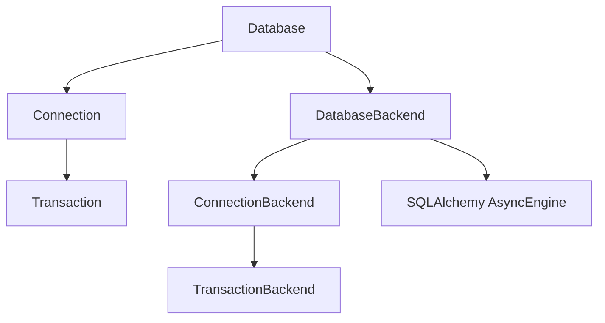
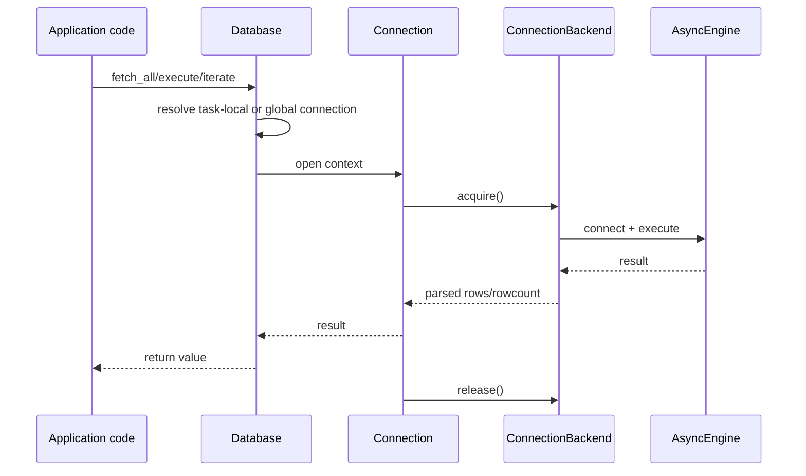
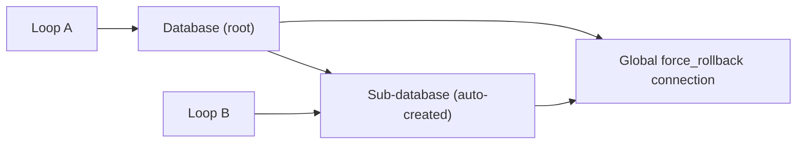

# Architecture Overview

Databasez is built around a small set of objects:

- `Database` for pool lifecycle and task-local connection routing.
- `Connection` for query execution and transaction orchestration.
- `Transaction` for context/decorator/manual transaction control.
- Backend classes (`DatabaseBackend`, `ConnectionBackend`, `TransactionBackend`) for dialect-specific behavior.

## Component relationships

## Query lifecycle

## Multiloop model

Databasez is loop-aware. If the same `Database` is used from a different event loop, it can create a sub-database for that loop and proxy operations safely.

For deeper details:

- [Core Concepts](./core-concepts.md)
- [Connections & Transactions](./connections-and-transactions.md)
- [Extra drivers and overwrites](./extra-drivers-and-overwrites.md)
