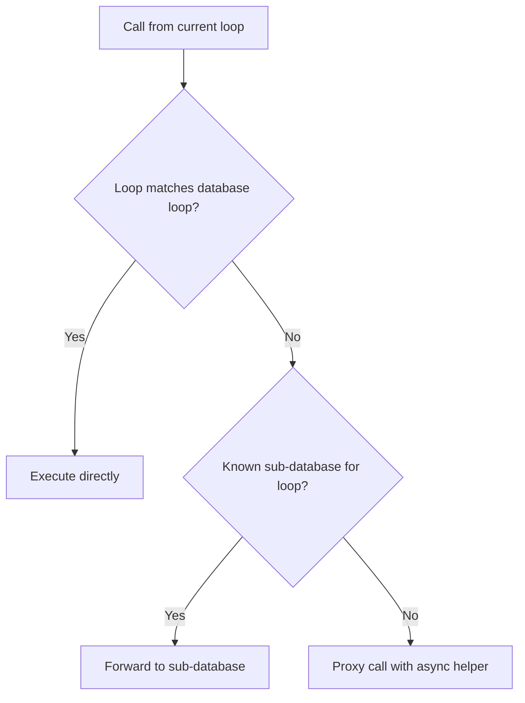
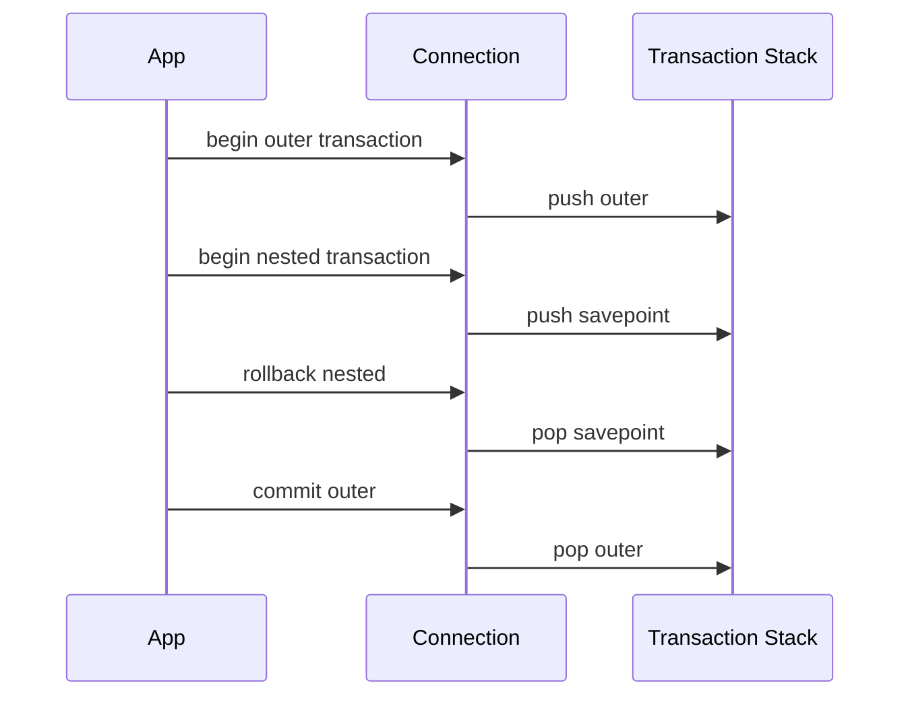

# Connections and Transactions

## Connections

Connections are the core execution unit in Databasez. Even when you call high-level methods on `Database`, those calls are routed through a `Connection`.

If you want multiple operations in one scoped connection, use:

```python
async with database.connection() as connection:
    await connection.execute(
        "INSERT INTO notes(text) VALUES (:text)",
        {"text": "example"},
    )
    rows = await connection.fetch_all("SELECT * FROM notes")
```

This is the recommended style for explicit control.

## Task-local behavior

Connections are task-local. Inside one task, repeated `database.connection()` calls reuse the same object. Different tasks receive different connections.

## Global connection in rollback mode

When `force_rollback=True`, `database.connection()` returns a global connection that is wrapped in rollback behavior.

This is useful for tests, but remember:

- you are effectively sharing one connection
- nested/parallel usage on the same connection must be planned carefully

Runnable example:

```python
{!> ../docs_src/connections/force_rollback.py !}
```

## Multiloop and multithreading

Databasez supports loop-aware routing:

- same loop: direct call
- different loop: operation is proxied using cross-loop helpers
- optional full isolation: global rollback connection in a dedicated thread



## Transactions

Transactions are lazily initialized and can be used in three ways.

### 1. Async context manager

```python
{!> ../docs_src/transactions/async_context_database.py !}
```

Or from a specific connection:

```python
{!> ../docs_src/transactions/async_context_connection.py !}
```

### 2. Decorator

```python
{!> ../docs_src/transactions/decorating.py !}
```

### 3. Manual control

```python
{!> ../docs_src/transactions/manually.py !}
```

## Transaction options

### `force_rollback`

`transaction(force_rollback=True)` always rolls back on exit.

```python
{!> ../docs_src/transactions/force_rollback_transaction.py !}
```

### Isolation level

You can pass backend-supported isolation levels:

```python
{!> ../docs_src/transactions/isolation_level.py !}
```

### Nested transactions

Nested transactions are supported through savepoints:

```python
{!> ../docs_src/transactions/nested_transactions.py !}
```

## Transaction stack model



## See also

- [Database](./database.md)
- [Queries](./queries.md)
- [Troubleshooting](./troubleshooting.md)
